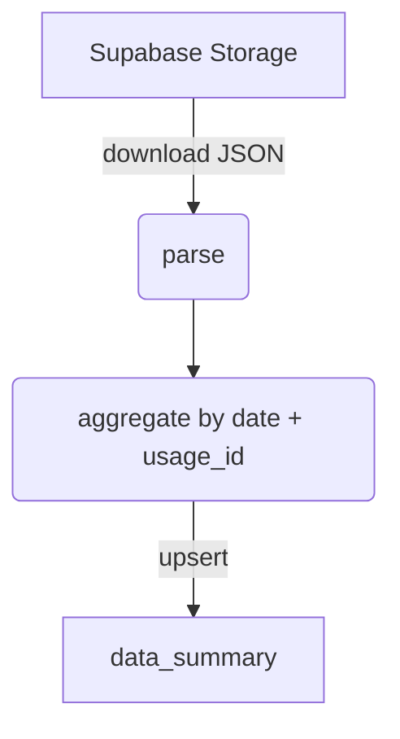

# Fitbit Dashboard – End‑to‑End Guide (English)

## ✨ High‑Level Overview
This project turns raw **Fitbit JSON exports** into actionable insights with **zero paid software**:

1. **Ingest** JSON files from Supabase Storage via `ingest.py`.
2. **Aggregate & upsert** daily metrics into the Postgres table `data_summary`.
3. **Visualise** those metrics in a Streamlit + Plotly dashboard—now featuring an **interactive date‑range picker** so you can zoom into any time window.

Everything runs on free‑tier Supabase + open‑source Python tools and is fully cross‑platform (Windows, macOS, Linux).

---

## 🚀 What’s New (July 2025)
* **Date‑range selector** in the dashboard (filter by any start/end dates). (july 2de)

---

## 📂 Repository Layout

```
fitbit_dashboard/
├── ingest.py          # Fetch & upsert JSON ➜ data_summary
├── dashboard.py       # Streamlit web app
├── requirements.txt   # Python dependencies
├── .env               # Supabase credentials (never commit!)
└── README.md          # You are here
```

---

## 🔗 Supabase Components

| Component                         | Purpose                                                                                                                                  |
| --------------------------------- | ---------------------------------------------------------------------------------------------------------------------------------------- |
| **Storage**                       | Stores raw Fitbit exports under `fitbit/<user_id>/<usage_id>/<category>/*.json`. Categories = `heart`, `steps`, `calories`, `hrv`, `br`. |
| **Postgres table** `data_summary` | Daily roll‑ups (`calories_total`, `steps_total`, `rhr`, `hrv_sleep`, `br_sleep`, `usage_id`, `date`). Primary key `(date, usage_id)`.    |
| **Row‑Level Security**            | Enabled. A *public\_read* policy grants `SELECT` to the **anon** role so the dashboard can read data with the public key.                |

---

## 1 – Ingestion Pipeline (`ingest.py`)



### Key points

* **Path‑agnostic**: the script scans every object in the `fitbit` bucket and extracts `usage_id`, `category`, and the first date found in the filename.
* **Metrics computed**

  * `calories_total` – from `activities‑calories[0].value`.
  * `steps_total` – from `activities‑steps[0].value`.
  * `rhr` – resting‑heart‑rate from `activities‑heart[0].value`.
  * `br_sleep` – nightly breathing rate (`fullSleepSummary.breathingRate`).
  * `hrv_sleep` – mean nightly RMSSD across `hrv[0].minutes[*].value.rmssd`.
* **Upsert**: `data_summary` is updated via `supabase.table("data_summary").upsert(...)`, avoiding duplicates thanks to the composite PK.

---

## 2 – Dashboard (`dashboard.py`)

* **Streamlit** renders a dropdown of available `usage_id` values (queried from `data_summary`).
* Selecting an ID triggers a read of all rows for that ID and plots:

  * Daily steps (bar)
  * Daily calories (bar)
  * Resting heart‑rate (line)
  * Sleep HRV & breathing‑rate (multi‑line)
* **Plotly** provides interactive zoom, tooltip, export as PNG.

---

## 3 – Environment Variables (`.env`)

```dotenv
SUPABASE_URL=https://<project>.supabase.co
SUPABASE_ANON_KEY=<public_anon_key>
# Optional – only needed if you keep RLS strict and let the script bypass it
SUPABASE_SERVICE_KEY=<service_role_key>
```

Get the keys in **Supabase > Settings > API > Project API keys**.

---

## 4 – Row‑Level‑Security Policy

```sql
alter table public.data_summary enable row level security;

create policy public_read
  on public.data_summary
  for select
  to anon
  using (true);
```

*Alternative*: keep RLS tight and run both `ingest.py` and `dashboard.py` with `SERVICE_ROLE`.

---

## 5 – Common Issues & Fixes

| Issue                                        | Root Cause                                                   | Fix                                                                                  |
| -------------------------------------------- | ------------------------------------------------------------ | ------------------------------------------------------------------------------------ |
| `invalid input syntax for type uuid: "None"` | Supabase query sent `None` as a UUID when no value selected. | Filter `None` client‑side instead of server‑side.                                    |
| No `usage_id` in dropdown                    | RLS blocks the **anon** role.                                | Create `public_read` policy or use `SERVICE_ROLE`.                                   |
| Virtual‑env activation errors                | Shell‑specific path separators.                              | Use `source venv/Scripts/activate` (Git Bash) or `venv\Scripts\Activate` (cmd/Pwsh). |

---

## 6 – Next Steps

* Deploy Streamlit on **Streamlit Community Cloud**, **Fly.io**, or **Railway**.
* Extend `data_summary` with activity zones, intensity minutes, etc.
* Add authentication‑based policies (`usage_id = auth.uid()`) for multi‑user dashboards.

---

*Last update: 2025‑07‑02*
